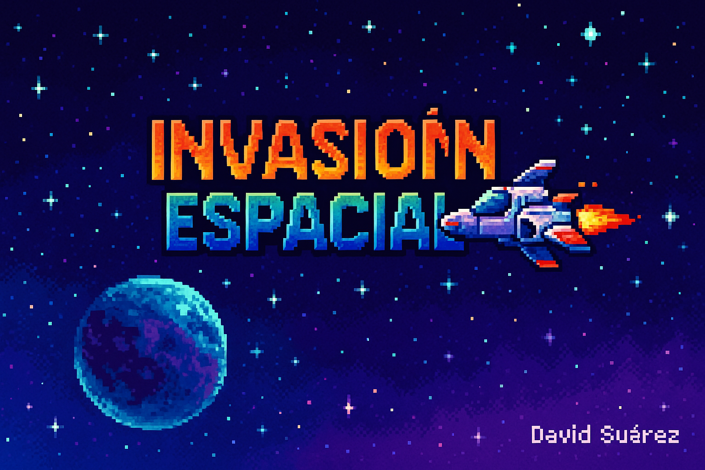

# 🚀 Invasión Espacial - Juego estilo retro en Python

## 🎮 Descripción

_Invasión Espacial_ es un juego arcade 2D inspirado en los clásicos de 16 bits, desarrollado en Python con Pygame. El jugador controla una nave espacial que debe enfrentarse a oleadas de enemigos, esquivar proyectiles, recoger power-ups y derrotar al jefe final.

## 🕹️ Controles

- ◀️ ▶️ Mover nave
- 🔫 Espacio para disparar
- 🅿️ P para pausar
- ⏎ Enter para comenzar
- 🔙 ESC para volver al menú

## 🧪 Power-ups

- 💙 Corazón: Recupera una vida
- ⚡ Rayo: Disparo rápido
- 🔫 Triple disparo

## 🎆 Características

- Sistema de oleadas con enemigos variados
- Jefes con ataques múltiples
- Explosiones animadas con efectos de sonido
- Menú retro con imagen de presentación
- Power-ups, puntuación y HUD integrado

## 📸 Vista previa

## 📦 Ejecutar el juego

### Desde código fuente

pip install pygame
python Main.py

## 👨‍💻 Autor
**David Suárez**
[GithHub](https://github.com/scod01)
[LinkedIn](https://www.linkedin.com/in/davidsuarez-dev)

¡Gracias por visitar este proyecto! Si te ha gustado, no olvides dejar una ⭐ en el repositorio.
